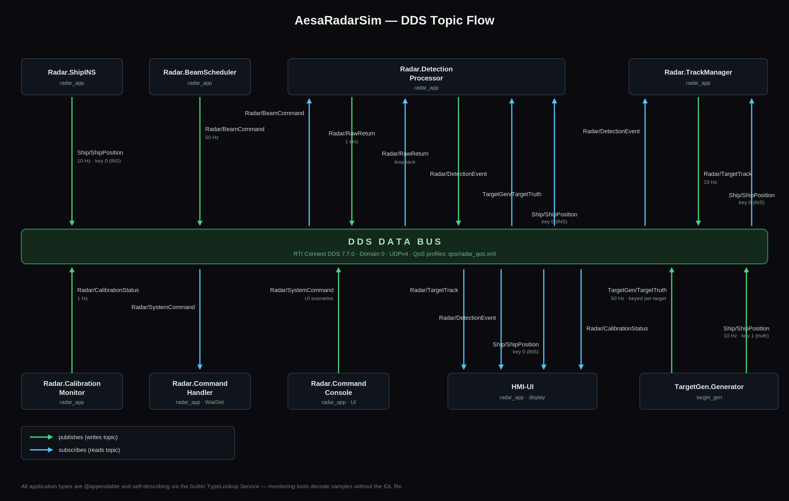

# AesaRadarSim

A radar simulation system modeled on publicly available **AESA SPY-6 class**
phased-array radar architecture, built on **RTI Connext DDS 7.7.0 LTS** and
modern **C++20**. Designed as a live webinar demo: **Connext Studio** (RTI's
VS Code extension) monitors, visualizes and diagnoses every DDS sample in a
separate workspace.

Two applications, one CMake monorepo, one DDS domain (default: domain 0):

| App          | Purpose |
|--------------|---------|
| `radar_app`  | Simulated radar on a moving ship. Internal components (BeamScheduler, DetectionProcessor, TrackManager, CalibrationMonitor, CommandHandler, **HMI-UI**) communicate **exclusively via DDS topics**. ImGui/GLFW/OpenGL 3.3 UI with PPI, A-scope, B-scope, track list, beam timeline, health and ship panels. |
| `target_gen` | Synthetic target generator (configurable trajectories, RCS, kinematics) publishing `TargetGen/TargetTruth` + ship-motion ground truth. Can inject QoS/type mismatches and the degraded-array scenario on demand. |

```
AesaRadarSim/
├── CMakeLists.txt               # macOS-first, Windows-ready build
├── cmake/                       # toolchain files (arm64 macOS, MSVC x64)
├── idl/radar_types.idl          # @appendable types, module radar::types
├── qos/radar_qos.xml            # single QoS file, 10 named profiles
├── src/common/                  # DDS bootstrap, SPSC queue, sim clock
├── src/radar_app/
│   ├── components/              # one class per radar component, one
│   │                            # DomainParticipant each (topology demo)
│   ├── ui/                      # PpiView, AScopeView, BScopeView, Panels
│   ├── hmi_ui/                  # HMI-UI DomainParticipant (display thread)
│   └── main.cpp
├── src/target_gen/              # TargetFleet + DiagnosticsInjector
└── docs/CONNEXT_STUDIO.md       # monitoring / diagnostics demo guide
```

---

## Prerequisites (macOS, Apple Silicon)

1. **RTI Connext DDS 7.7.0 LTS** with the `arm64Darwin20clang12.0` target
   installed, e.g. at `/Applications/rti_connext_dds-7.7.0`.
2. CMake >= 3.20 (`brew install cmake`), Xcode Command Line Tools.
3. Git (GLFW / Dear ImGui / ImPlot are pulled by CMake FetchContent at
   configure time — no vcpkg or manual dependency management needed).

## Build (macOS)

```bash
export CONNEXTDDS_DIR=/Applications/rti_connext_dds-7.7.0
cmake -B build \
      -DCMAKE_TOOLCHAIN_FILE=cmake/toolchain-macos-arm64.cmake \
      -DCMAKE_BUILD_TYPE=RelWithDebInfo
cmake --build build -j
```

The QoS file is copied next to the binaries automatically
(`build/qos/radar_qos.xml`). Override at runtime with `RADAR_QOS_FILE`.

## Run

```bash
# Terminal 1 — the radar console (opens the GUI)
# (use the rtisetenv script matching YOUR Connext target architecture)
source $CONNEXTDDS_DIR/resource/scripts/rtisetenv_arm64Darwin23clang16.0.bash
./build/radar_app

# Terminal 2 — the target generator
source $CONNEXTDDS_DIR/resource/scripts/rtisetenv_arm64Darwin23clang16.0.bash
./build/target_gen --targets 8

# Diagnostic scenarios (combinable):
./build/target_gen --inject-qos-mismatch     # RELIABLE reader vs BEST_EFFORT writer
./build/target_gen --inject-type-mismatch    # wrong type on TargetGen/TargetTruth
./build/target_gen --degrade-array           # sends CMD_DEGRADE_ARRAY at t+5s
```

> On macOS, Connext shared libraries are resolved via `@rpath`; sourcing
> `rtisetenv_*.bash` (or exporting `DYLD_LIBRARY_PATH` to the target `lib`
> directory) is required before launching.

Both apps accept `--domain N` (default 0). The radar UI also has a
**SCENARIOS** panel (bottom-right) issuing `Radar/SystemCommand`s:
search/sector mode, degrade/restore array, self test, track reset.

> **macOS note (shared memory):** the shipped profiles use **UDPv4 only**.
> macOS defaults allow very few System V shared-memory segments, and the
> radar app's seven participants exhaust them (RTI KB
> [osx510](http://community.rti.com/kb/osx510)), which otherwise ends in
> "No index available for participant" errors. If you raise the sysv
> limits per that KB, you can switch the transport masks back to
> `UDPv4 | SHMEM` in `qos/radar_qos.xml` — no rebuild needed, QoS is
> loaded at runtime.

## Windows 11 port (Visual Studio 2022)

Everything is already portable; the only platform work is the toolchain:

```powershell
cmake -B build -G "Visual Studio 17 2022" -A x64 `
      -DCMAKE_TOOLCHAIN_FILE=cmake/toolchain-windows-msvc.cmake `
      -DCONNEXTDDS_DIR="C:\Program Files\rti_connext_dds-7.7.0"
cmake --build build --config RelWithDebInfo
```

- Connext target: `x64Win64VS2017` (binary-compatible with VS2022).
- GLFW/ImGui/ImPlot still come from FetchContent (vcpkg optional).
- Put Connext DLLs on `PATH` (or copy next to the exe) before running.

---

## Architecture


([vector source](docs/dds_architecture.svg))

Every internal radar component is a named DomainParticipant wired to the
others purely through topics on the shared bus — there are no direct
in-process calls between components. The **HMI-UI** participant is the
ImGui/GLFW/OpenGL display thread; it never blocks on DDS but drains
lock-free SPSC queues fed by DDS listener callbacks. (Connext Studio joins
the same domain from a separate workspace and can read every topic shown;
see [docs/CONNEXT_STUDIO.md](docs/CONNEXT_STUDIO.md). Not shown: the
on-demand diagnostic endpoints `target_gen` creates with
`--inject-qos-mismatch`, `--inject-type-mismatch` and `--degrade-array`.)

### DDS topics

| Topic | Type | Rate | Profile | Notes |
|---|---|---|---|---|
| `Radar/RawReturn` | RawReturn | 1 kHz | RawReturnProfile | BEST_EFFORT, 500us latency budget. The "receiver wire", looped back inside DetectionProcessor |
| `Radar/DetectionEvent` | DetectionEvent | ~100 Hz | DetectionEventProfile | BEST_EFFORT CFAR blips; consumed by HMI-UI (PPI, A-scope, B-scope) |
| `Radar/BeamCommand` | BeamCommand | 50 Hz | BeamCommandProfile | RELIABLE dwell schedule |
| `Radar/TargetTrack` | TargetTrack | 10 Hz | TargetTrackProfile | RELIABLE + TRANSIENT_LOCAL + 100 ms deadline; consumed by HMI-UI (track list) |
| `Radar/CalibrationStatus` | CalibrationStatus | 1 Hz | CalibrationStatusProfile | array health, 1024 elements; consumed by HMI-UI (health panel) |
| `Radar/SystemCommand` | SystemCommand | bursty | SystemCommandProfile | RELIABLE, WaitSet-handled |
| `Ship/ShipPosition` | ShipPosition | 10 Hz | ShipPositionProfile | keyed: 0 = INS, 1 = truth; consumed by DetectionProcessor (coordinate stabilization), TrackManager (track correlation), and HMI-UI (ship panel) |
| `TargetGen/TargetTruth` | TargetTruth | 50 Hz/target | TargetTruthProfile | keyed per target |

### DetectionProcessor loopback simplification

`Radar.DetectionProcessor` is a **deliberate architectural simplification** for the demo.
In a real phased-array radar the transmit and receive chains are physically separate:
the T/R modules fire a pulse, switch to receive microseconds later, and the digital
beamformer aggregates returns from all elements before handing them to the CFAR engine.

For this simulation, `DetectionProcessor` **both publishes and subscribes** to
`Radar/RawReturn` (the 1 kHz loopback shown in the diagram). The participant
**produces** the synthetic I/Q data — modeling the pulse-repetition-rate stream
that would come from the radar face — and then **consumes it back** to run CFAR
detection processing.

The realism is baked in via the `TargetGen/TargetTruth` subscription:
DetectionProcessor reads the ground-truth target positions, then synthesizes
range-bin I/Q samples with appropriate RCS, Doppler shift, and noise so that
the 1 kHz `RawReturn` stream looks like genuine radar data rather than random
numbers. Sea clutter and other environmental returns are also synthesized.

> **Production note:** a real system would not put raw I/Q on DDS at 1 kHz × 512 bins
> (~2 MB/s). The loopback exists here to stress-test the middleware and to make the
> full data flow visible in Connext Studio. A deployed architecture would use separate
> `Radar.Transmitter` and `Radar.Receiver` participants, with the raw data staying on
> a high-bandwidth internal fabric (PCIe, RDMA, or shared memory) rather than the
> DDS data bus.

### WaitSet vs. listener split

- **Listeners** (DDS receive threads): `RawReturn`, `BeamCommand`,
  `TargetTruth`, `DetectionEvent` — high rate, lightweight callbacks that
  only cache or enqueue.
- **WaitSet** (dedicated thread): `SystemCommand` — lower rate, handled
  atomically and in order by `CommandHandler`.
- **HMI-UI / Render thread**: never blocks on DDS; drains lock-free SPSC queues
  and mutex-protected stores from the `DataBus` at display rate. DDS threads
  never touch ImGui/OpenGL.

### Type system

All application types are `@appendable` (forward-compatible field
additions) and fully self-describing; with Connext 7.x the builtin
**TypeLookup Service** is enabled by default, so Connext Studio decodes
samples without the IDL file. Coordinate frames are documented in the IDL:
ship-relative polar for detections, ship-relative ENU for tracks/truth.

### Deliberate demo choices (not production patterns)

- Each radar component owns a **separate DomainParticipant** so Connext
  Studio's topology map shows `Radar.BeamScheduler`, `Radar.TrackManager`,
  etc. as individual nodes. A production system would use one participant
  with several publishers/subscribers.
- `RawReturn` at 1 kHz x 512 bins (~2 MB/s) exercises the bus for the demo;
  a real system would not put raw I/Q on DDS at this rate.
- QoS **variety is intentional** (BEST_EFFORT sensor paths vs RELIABLE
  command/track paths) so Studio's match analysis has something to show.

## Performance notes

- 60 FPS with 100+ tracks / 1000+ active blips: blip pooling (fixed ring,
  no per-frame allocation), preallocated polyline buffers, single GL
  texture upload per frame for the B-scope, SPSC handoff (no locks on the
  render path), delta-time animation everywhere.

## Connext Studio

See **[docs/CONNEXT_STUDIO.md](docs/CONNEXT_STUDIO.md)** for the full demo
script: separate workspace setup, topology map, live data inspection, QoS
mismatch diagnostics, and the injected-failure scenarios.
