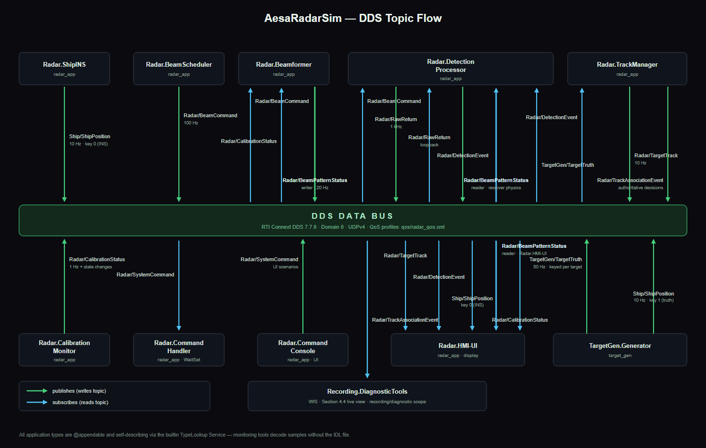
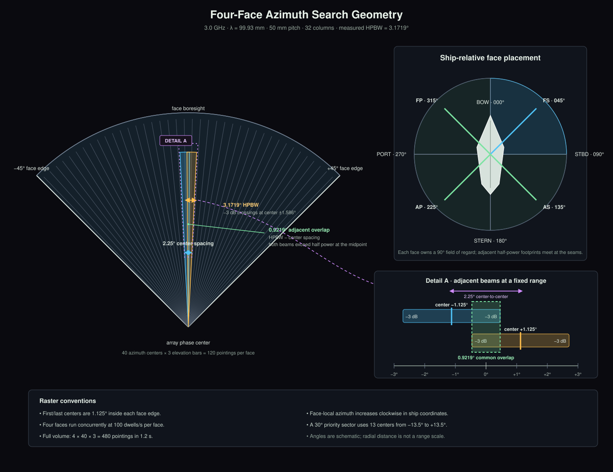
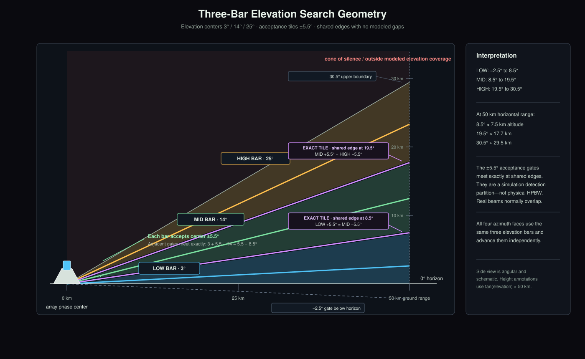
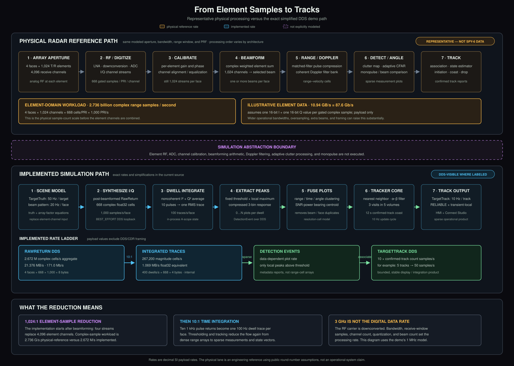

# AesaRadarSim

A radar simulation system modeled on publicly available **AESA SPY-6 class**
phased-array radar architecture, built on **RTI Connext DDS 7.7.0 LTS** and
modern **C++20**. Designed as a live webinar demo: **Connext Studio** (RTI's
VS Code extension) monitors, visualizes and diagnoses every DDS sample in a
separate workspace.

> **Windows 11 users:** Start with the
> **[Windows 11 Clean-Machine Runbook](docs/RUN_WINDOWS.md)**. It gives one
> complete, numbered path from installing prerequisites and cloning the
> repository through building, testing, and launching the demo.
>
> **Display presenters:** Use the
> **[Radar Display Operator Guide](docs/OPERATOR_DISPLAY_GUIDE.md)** for panel
> meanings, coordinate frames, colors, controls, and common audience
> questions.
>
> **Target scenario authors:** Use the
> **[Target Control Guide](docs/TARGET_CONTROL.md)** for the separate control
> domain, additive scenario lifecycle, and target-removal controls.

Three applications in one CMake monorepo. Radar data stays on the simulation
DDS domain; the optional target-management UI uses a separate control domain:

| App          | Purpose |
|--------------|---------|
| `radar_app`  | Simulated radar on a moving ship. Internal components (BeamScheduler, Beamformer, DetectionProcessor, TrackManager, CalibrationMonitor, CommandHandler, CommandConsole, HMI-UI) communicate **exclusively via DDS topics**. ImGui UI (native Metal on macOS, OpenGL 3.3 elsewhere) with PPI, A-scope, B-scope, track list, beam timeline, health, ship and ARRAY FACE panels (click an RMA block to take it offline). |
| `target_gen` | Synthetic target generator publishing `TargetGen/TargetTruth` + ship-motion ground truth on the simulation domain. A second participant accepts additive scenario management on the separate control domain. |
| `target_control` | Dedicated ImGui target-management UI. Discovers the scenario catalog, adds repeated independent instances, removes targets/groups, and clears the fleet without restarting the simulation. |

```
AesaRadarSim/
├── CMakeLists.txt               # macOS-first, Windows-ready build
├── cmake/                       # toolchain files (arm64 macOS, MSVC x64)
├── idl/radar_types.idl          # @appendable types, module radar::types
├── qos/radar_qos.xml            # single QoS file, 15 named profiles
├── src/common/                  # DDS bootstrap, SPSC queue, sim clock
├── src/radar_app/
│   ├── components/              # one class per radar component, one
│   │                            # DomainParticipant each (topology demo)
│   ├── ui/                      # PpiView, AScopeView, BScopeView, Panels
│   └── main.cpp
├── src/target_gen/              # DDS adapter + testable target scenario core
├── src/target_control/          # separate-domain target management UI
├── scripts/run-demo.sh          # one-command Bash demo launcher
├── scripts/windows/start-all.cmd # Windows launcher for all three processes
├── tests/                       # headless UI, target, and tracker regressions
├── ConnextStudioDemo.md         # live webinar workspace-switching runbook
└── docs/CONNEXT_STUDIO.md       # monitoring / diagnostics demo guide
```

---

## Prerequisites (macOS, Apple Silicon)

1. **RTI Connext DDS 7.7.0 LTS** with an Apple Silicon target matching the
   active toolchain (for example `arm64Darwin23clang16.0`), installed at a
   location such as `/Applications/rti_connext_dds-7.7.0`.
2. CMake >= 3.21 (`brew install cmake`), Xcode Command Line Tools.
3. Git (GLFW / Dear ImGui / ImPlot are pulled by CMake FetchContent at
   configure time — no vcpkg or manual dependency management needed).

## Build (macOS)

```bash
export CONNEXTDDS_DIR=/Applications/rti_connext_dds-7.7.0
cmake -B build \
      -DCMAKE_TOOLCHAIN_FILE=cmake/toolchain-macos-arm64.cmake \
      -DCMAKE_BUILD_TYPE=RelWithDebInfo
cmake --build build -j
```

The QoS file is copied next to the binaries automatically
(`build/qos/radar_qos.xml`). Override at runtime with `RADAR_QOS_FILE`.

## Regression tests

The default build registers ten fast, headless CTest regressions:

```bash
cmake --build build -j
ctest --test-dir build --output-on-failure
```

- `ui_controls_smoke` renders the production ImGui A-scope and panels in
  memory, performs real mouse press/hold/release frames, and verifies all
  scenario controls (including the local **BEAM FORMATION** toggle), manual
  per-face selection, RMA offline/online, and the dynamic
  **ALL OFFLINE / ALL ONLINE** control. The A-scope
  azimuth/elevation changes throughout to cover the focus-loss regression.
- `target_scenario_regression` accelerates 30 minutes of a deterministic
  16-target scenario containing the fixed 12 km baseline orbit and 15
  randomized targets, and checks stable IDs/profile mix, bounded motion,
  deterministic seeded behavior, the missile altitude floor, and periodic
  120 km respawns. It also verifies additive scenario instances,
  deterministic separation of repeated launches, individual/group removal,
  clear-all, the 15-second minimum-range transit, the one-shot face-seam
  handoff, the free-bearing two-target crossing geometry, and the
  face-boundary crossing variant.
- `tracker_replay_regression` runs the four concurrent face rasters, independent
  post-beamforming streams, ten-pulse dwell integration, resolution-cell plot
  fusion, and production tracker against deterministic golden event counts
  and track-ID pool bounds. It also verifies three-scan confirmation,
  beam-cell transition continuity, state-preserving duplicate fusion, and the
  exact 12-second confirmed-track coast/drop boundary. Running
  `./build/tracker_replay [seconds]` directly retains periodic diagnostics;
  assertions are enabled only by CTest's `--self-test` flag.
- `beam_pattern_regression` verifies nominal beamwidth, outage gain loss,
  symmetric-error cancellation, mask-position sensitivity, and safe
  all-offline behavior without DDS or a display.
- `search_raster_regression` enumerates the 480-point full-volume raster and
  verifies the 1.2-second concurrent four-face period, face-edge inset,
  30-degree sector behavior, and nominal half-power overlap between adjacent
  azimuth pointings.
- `detection_processor_regression` verifies ten-pulse noncoherent dwell
  integration, one-plot extraction, the production CFAR-like peak picker, and
  all-offline suppression.
- `periodic_deadline_regression` simulates an eight-hour machine sleep and
  verifies that fixed-rate simulation loops resume at their normal cadence
  without replaying millions of missed ticks.
- `radar_faces_regression` verifies the bounded DDS keys, masks, boresights,
  shared boundaries, and gap-free 360-degree four-face geometry.
- `face_detection_fusion_regression` verifies that unresolved adjacent-dwell
  and cross-face reports fuse across 0/360 and 90-degree boundaries into an
  SNR-weighted bearing while range-resolvable targets remain distinct.

These tests create no DDS participants, graphics window, or renderer, so they
do not alter or compete with a live webinar run.

## Run

### Complete interactive demo on Windows

The primary Windows launcher starts the radar display, target generator, and
target-management UI together:

```bat
scripts\windows\start-all.cmd -Domain 92 -Targets 32
```

Use `start-all.cmd` for interactive development, operator demonstrations, and
webinars where targets must be added or removed while the radar continues
running. It puts radar traffic on simulation domain 92 and target-management
traffic on control domain 93 by default, configures the Connext DLL and QoS
environment, and writes separate logs for all three processes. Close the radar
window to stop the complete demo cooperatively.

The launcher uses `CONNEXTDDS_DIR` or `NDDSHOME`, falling back to the standard
Connext 7.7.0 installation under `C:\Program Files`. The executables must
already be built. See the
[Windows 11 Clean-Machine Runbook](docs/RUN_WINDOWS.md) for the complete setup
and build procedure.

Common `start-all.cmd` options:

| Option | Default | Description |
|--------|---------|-------------|
| `-Domain N` | `92` | Select the simulation DDS domain (`0..232`). |
| `-ControlDomain N` | Simulation domain + 1 | Select the separate target-management domain. |
| `-Targets N` | `32` | Start with one baseline orbit plus `N-1` randomized inbound targets. |
| `-Configuration NAME` | `RelWithDebInfo` | Select `Debug`, `RelWithDebInfo`, or `Release`. |
| `-BuildDir PATH` | `build\windows-x64` | Use a specific CMake build directory. |
| `-ConnextDir PATH` | Environment/standard install | Use a specific RTI Connext installation. |
| `-RunSeconds N` | Until the radar closes | Stop all three processes automatically after `N` seconds. |

### Interactive demo on macOS

The Bash launcher starts the radar display and target generator, selects the
preset or legacy build automatically, configures the Connext runtime and QoS
paths, writes separate logs, and stops both processes together:

```bash
./scripts/run-demo.sh --domain 92 --targets 32
```

It uses `CONNEXTDDS_DIR` or `NDDSHOME` and also detects the default
`/Applications/rti_connext_dds-7.7.0` installation. Close the radar window or
press Ctrl-C in the launcher to stop both processes cooperatively. The
launcher prints the command for starting the optional `target_control` UI
separately.

Bash launcher options:

| Option | Default | Description |
|--------|---------|-------------|
| `--build-dir PATH` | Auto-detect | Use a specific CMake build directory instead of searching `build/macos-arm64`, `build`, and the repository installation layout. |
| `--connext-dir PATH` | Environment/auto-detect | Use a specific RTI Connext installation instead of `CONNEXTDDS_DIR`, `NDDSHOME`, or the default macOS installation. |
| `--domain N` | `92` | Select DDS domain `0..232`. |
| `--targets N` | `32` | Launch `target_gen` with `1..256` total targets: one fixed 12 km baseline orbit plus `N-1` randomized inbound targets. With `N=1`, only the baseline is generated. |
| `--run-seconds N` | `0` | Stop automatically after `N` seconds (`0..604800`); zero runs until window close or Ctrl-C. |
| `--headless` | Off | Run `radar_app` without the graphics window. |
| `-h`, `--help` | — | Print launcher usage and exit. |

### Unattended DDS-only runs

Use an unattended DDS-only run for automated smoke checks, bounded soak tests,
remote machines without a display, or Connext Studio captures that need live
radar traffic but no operator interaction. The headless radar still creates
its DDS participants and runs the complete processing pipeline; only the
graphics and target-management windows are omitted. `RunSeconds` gives
automation a deterministic stop time, and the launchers retain stdout and
stderr logs for diagnosis.

```bat
rem Windows
scripts\windows\run-demo.cmd -Domain 92 -Targets 32 -Headless -RunSeconds 20
```

```bash
# macOS
./scripts/run-demo.sh --domain 92 --targets 32 --headless --run-seconds 20
```

To run the applications manually in separate terminals:

```bash
# Terminal 1 — the radar console (opens the GUI)
# (use the rtisetenv script matching YOUR Connext target architecture)
# NOTE: radar_app is built as a macOS bundle — the plain ./build/radar_app
# path is a stale pre-bundle leftover and is NEVER relinked. Run the binary
# inside the bundle (it also keeps stdout, which the bare .app does not):
source $CONNEXTDDS_DIR/resource/scripts/rtisetenv_arm64Darwin23clang16.0.bash
./build/radar_app.app/Contents/MacOS/radar_app

# Terminal 2 — the target generator
# Live webinars use 32 total targets: one deterministic fighter circling the
# ship at 12 km slant range plus 31 randomized inbound targets. Randomized
# targets are recycled past 120 km so the picture stays busy; tune with
# --respawn-range KM, 0 disables.
source $CONNEXTDDS_DIR/resource/scripts/rtisetenv_arm64Darwin23clang16.0.bash
./build/target_gen --domain 92 --control-domain 93 --targets 32

# Terminal 3 — optional target scenario control UI (control domain only)
./build/target_control --domain 93

# Diagnostic scenarios (combinable):
./build/target_gen --inject-qos-mismatch     # RELIABLE reader vs BEST_EFFORT writer
./build/target_gen --inject-type-mismatch    # wrong type on TargetGen/TargetTruth
./build/target_gen --degrade-array           # sends CMD_DEGRADE_ARRAY at t+5s
./build/target_gen --rma-offline 3           # sends CMD_RMA_OFFLINE (RMA 3) at t+5s
                                             # ("all" = whole face; restore via the
                                             # ARRAY FACE pane's dynamic button)
./build/target_gen --degrade-array --face fp # target FP; fs/as/ap/fp/all accepted
```

> On macOS, Connext shared libraries are resolved via `@rpath`; sourcing
> `rtisetenv_*.bash` (or exporting `DYLD_LIBRARY_PATH` to the target `lib`
> directory) is required before launching.

`target_gen --control-domain N` defaults to the simulation domain plus one
(wrapping after 232) and must differ from `--domain`. `target_control --domain`
selects that control domain; it never joins the radar data domain. Scenario
selection is additive, and **CLEAR ALL** disposes all current target instances
without stopping `target_gen`. See [Target Control](docs/TARGET_CONTROL.md).

Both simulation apps accept `--domain N` (default 0). The radar UI also has a
**SCENARIOS** panel (bottom-right). Search/sector mode, degrade/restore array,
self test, and track reset issue `Radar/SystemCommand`s. **BEAM FORMATION**
is a local display toggle: it replaces the compact moving outage curtain with
an animated, rotating 3D comparison: nominal first moves into the left half
when an outage occurs, the full-size degraded pattern then appears in the
right half, both rotate together for direct shape comparison, and nominal
recenters on recovery.
The **ARRAY FACE** panel selects FS, AS, AP, or FP and issues face-addressed
`CMD_RMA_OFFLINE`/`CMD_RMA_ONLINE`: click an RMA block (16 blocks of 64 T/R
elements) to toggle it. The whole-face button reads **ALL OFFLINE** unless
that face is already dark, when it changes to **ALL ONLINE**. Offline RMAs
darken the block and set the selected face instance's bit
in `CalibrationStatus.rma_offline_mask`. `Radar.Beamformer` combines that
health state with `BeamCommand`, publishes the effective response as
`BeamPatternStatus`, and thereby reduces implant gain, reshapes the beam
according to outage geometry, and activates the compact outage overlay on the
B-scope. With all 16 RMAs offline, raw receiver noise remains visible but
`DetectionEvent` publication stops; confirmed tracks coast for up to 12
seconds before the tracker drops them.

> **macOS note (shared memory):** the shipped profiles use **UDPv4 only**.
> macOS defaults allow very few System V shared-memory segments, and the
> radar app's nine participants exhaust them (RTI KB
> [osx510](http://community.rti.com/kb/osx510)), which otherwise ends in
> "No index available for participant" errors. If you raise the sysv
> limits per that KB, you can switch the transport masks back to
> `UDPv4 | SHMEM` in `qos/radar_qos.xml` — no rebuild needed, QoS is
> loaded at runtime.

## Windows 11 port (Visual Studio 2022)

For a clean Windows 11 machine, follow
**[docs/RUN_WINDOWS.md](docs/RUN_WINDOWS.md) from Step 1 without skipping
steps**. Enter its commands in a regular Command Prompt (`cmd.exe`). The
runbook clones the repository into a parent folder selected by the user,
changes to the repository root once, verifies every prerequisite, and keeps
all setup, build, test, and launch commands in that directory.

- Connext target: `x64Win64VS2017` (binary-compatible with VS2022).
- The UI embeds Per-Monitor V2 DPI awareness and uses GLFW/OpenGL 3.3.
- `windows-portable` builds all ten display-free regressions without Connext.
- FetchContent supplies pinned GLFW, ImGui, and ImPlot sources.
- Put the Connext target DLL directory on `PATH` before running.

---

## Architecture


([vector source](docs/dds_architecture.svg))

Every internal radar component is a named DomainParticipant wired to the
others purely through topics on the shared bus — there are no direct
in-process calls between components. `Radar.BeamScheduler` publishes desired
pointing, while `Radar.Beamformer` combines it with
`Radar/CalibrationStatus` and owns the actual outage-aware beam response.
Both `Radar.DetectionProcessor` and the **HMI-UI** consume that response from
`Radar/BeamPatternStatus`. The **HMI-UI** participant is the
display endpoint: it subscribes to `Radar/TargetTrack`,
`Radar/DetectionEvent`, `Ship/ShipPosition`, `Radar/CalibrationStatus`, and
`Radar/BeamPatternStatus` (the B-scope degradation overlay),
so every panel renders data that arrived over the bus — no dangling
publishers anywhere in the system. Its listener callbacks only convert
samples into view structs in a `DataBus` (lock-free SPSC queues +
mutex-protected stores), which the render thread drains at display rate:
the GUI can never stall a DDS receive thread, and DDS threads never touch
OpenGL. (Connext Studio joins the same domain from a
separate workspace and can read every topic shown; see
[docs/CONNEXT_STUDIO.md](docs/CONNEXT_STUDIO.md). Not shown: the
on-demand diagnostic endpoints `target_gen` creates with
`--inject-qos-mismatch`, `--inject-type-mismatch` and `--degrade-array`.)

### Four-face architecture

The DDS schema reserves exactly four face keys, clockwise in ship-relative
azimuth. The same bounded values key `BeamCommand`, `BeamPatternStatus`,
`RawReturn`, `DetectionEvent`, and `CalibrationStatus`; one topic therefore
carries four face instances instead of requiring four duplicate topic names.

| Key | Code | Face | Boresight | Field of regard |
|---:|---|---|---:|---:|
| 0 | FS | Forward Starboard | 045° | 000°–090° |
| 1 | AS | Aft Starboard | 135° | 090°–180° |
| 2 | AP | Aft Port | 225° | 180°–270° |
| 3 | FP | Forward Port | 315° | 270°–360° |

`SystemCommand.target_face_mask` selects one or more of those instances; zero
is the mixed-version legacy encoding for Forward Starboard. One scheduler
thread advances four independent 100 Hz face rasters. Calibration,
beamforming, raw I/Q, A/B-scope state, and aperture commands remain isolated
per key. The PPI combines all four views. Near shared face seams, physically
overlapping apertures can both report the same target. Adjacent beams on one
face can do the same because their half-power footprints overlap. Tracker
input therefore fuses reports that occupy one modeled time/range/angle
resolution cell and uses SNR-derived power weighting to estimate a bearing
between beam centers. Resolvable contacts remain separate.





### DDS topics

| Topic | Type | Rate | Profile | Notes |
|---|---|---|---|---|
| `Radar/RawReturn` | RawReturn | 1 kHz/face; 4 kHz aggregate | RawReturnProfile | BEST_EFFORT, four face-keyed post-beamforming I/Q streams; 500us latency budget. Each sample contains 668 complex range cells and loops back inside DetectionProcessor |
| `Radar/DetectionEvent` | DetectionEvent | data-dependent, all faces | DetectionEventProfile | BEST_EFFORT, face-keyed dwell-integrated CFAR-like plots; consumed by resolution-cell fusion/TrackManager and HMI-UI (PPI) |
| `Radar/BeamCommand` | BeamCommand | 100 Hz/face; 400 Hz aggregate | BeamCommandProfile | RELIABLE face-keyed dwell schedule; consumed by Beamformer and DetectionProcessor |
| `Radar/BeamPatternStatus` | BeamPatternStatus | 20 Hz/face; 80 Hz aggregate | BeamPatternStatusProfile | Face-keyed Beamformer-owned RELIABLE + TRANSIENT_LOCAL outage metrics and 181-sample azimuth cut; consumed by DetectionProcessor (return synthesis) and HMI-UI (B-scope overlay) |
| `Radar/TargetTrack` | TargetTrack | 10 Hz | TargetTrackProfile | RELIABLE + TRANSIENT_LOCAL + 200 ms deadline; consumed by HMI-UI (track list) |
| `Radar/CalibrationStatus` | CalibrationStatus | 1 Hz/face + changes | CalibrationStatusProfile | Face-keyed array health: 1024-element drift + `rma_offline_mask`; consumed by Beamformer and HMI-UI (health + ARRAY FACE panels) |
| `Radar/SystemCommand` | SystemCommand | bursty | SystemCommandProfile | RELIABLE, WaitSet-handled; `target_face_mask` addresses one or more faces |
| `Ship/ShipPosition` | ShipPosition | 10 Hz | ShipPositionProfile | keyed: 0 = INS, 1 = truth; key 0 consumed by HMI-UI (ship panel) |
| `TargetGen/TargetTruth` | TargetTruth | 50 Hz/target | TargetTruthProfile | keyed per target |

All keyed topics have a **bounded key space** (four face ids, constant source
ids, a recycled track-id pool, and a modulo command-id range): an
ever-incrementing key would register a new DDS instance per sample and grow
writer/reader memory without bound.

### DetectionProcessor loopback simplification

`Radar.DetectionProcessor` is a **deliberate architectural simplification** for the demo.
In a real phased-array radar the transmit and receive chains are physically separate:
the T/R modules fire a pulse, switch to receive microseconds later, and the digital
beamformer aggregates returns from all elements before handing them to the CFAR engine.

For this simulation, `DetectionProcessor` **both publishes and subscribes** to
`Radar/RawReturn` (four keyed 1 kHz loopbacks). The participant **produces**
four independent synthetic post-beamforming I/Q streams—one for each radar
face—and then **consumes them back** to run dwell integration and CFAR-like
plot extraction.

The realism is baked in via the `TargetGen/TargetTruth` subscription:
DetectionProcessor reads the ground-truth target positions, extrapolates each
50 Hz truth sample to the current pulse, and then synthesizes coherent range-bin
I/Q with two-way carrier phase, RCS-based amplitude, 1/r^4 received-power
attenuation, and a Rayleigh noise floor. It applies the effective gain, width,
pointing error, and sidelobes received from `Radar.Beamformer` over
`Radar/BeamPatternStatus`, then spreads each return over a short compressed-pulse
response. Each 1 kHz face instance therefore behaves like radar data rather
than random numbers.

For each 10 ms pointing, the receiver noncoherently averages I/Q power from
the ten 1 kHz pulses and performs peak extraction once on the resulting RMS
range trace. Thus a target produces a dwell plot, not ten independent tracker
hits. Before association, unresolved reports from overlapping adjacent beams
or face seams are combined into one SNR-weighted range/bearing plot. The
tracker uses separate range and cross-range gates (the latter grows with
range), confirms only after three independent scan visits within five nominal
face volumes, and then permits a confirmed track to coast for 12 seconds.

### Representative RF and waveform model

The simulator treats SPY-6 as the S-band component of the ship radar suite. It
does not claim an exact operational SPY-6 frequency or waveform. The shared
unclassified model in `RadarRfModel.hpp` uses a representative 3.0 GHz search
carrier:

- wavelength: 9.993 cm;
- physical azimuth-element pitch: 50 mm, or 0.5003 wavelength;
- waveform bandwidth: 1 MHz, giving 149.9 m range resolution;
- pulse repetition frequency: 1 kHz, giving 149.9 km unambiguous range;
- pulse width: 20 microseconds, giving a 3.0 km transmit/receive blind range
  and 2 percent duty cycle;
- instrumented range: 100 km, represented by 668 complex range cells.

These quantities drive the simulation. Physical pitch divided by wavelength
sets the array factor; wavelength scales received voltage consistently with
the monostatic radar equation; bandwidth sets range-bin spacing; pulse width
sets minimum receive range; PRF schedules raw returns; and propagated
two-way carrier phase is written into I/Q. The same metadata is appended to
`Radar/BeamPatternStatus` so it is visible in Connext Studio.

Each face uses 40 half-step-inset azimuth centers at 2.25-degree spacing on
each of three elevation bars: 120 pointings per face. All four faces advance
concurrently at 100 Hz, so the radar publishes 480 face-keyed pointings per
1.2-second full volume. The nominal azimuth pattern is calculated from the
32-column aperture with 50 mm physical spacing at the representative 3 GHz
carrier and has an approximately 3.2-degree 3 dB beamwidth. Adjacent
half-power footprints therefore overlap by about 0.9 degree; the raster has
no nominal azimuth dead stripes.

> **Production note:** a real system would not put four raw-I/Q streams on DDS
> at 1 kHz × 668 complex cells (about 5.3 MB/s per face, 21.4 MB/s aggregate
> before DDS overhead). The loopback exists to stress-test the middleware and
> make the full data flow visible in Connext Studio. A deployed architecture
> would keep raw data on a high-bandwidth internal fabric (PCIe, RDMA, or
> shared memory) rather than the DDS data bus.

### Signal-processing pipeline and data-rate reduction

The physical reference path and the implemented simplification are aligned
below. The upper rate is calculated from the same four 1,024-element faces,
668-cell receive window, and 1 kHz PRF used by the simulator; it is not a claim
about operational SPY-6 throughput. The comparison separates complex-sample
workload from payload byte rate and shows exactly where the implementation
removes the element-channel dimension, integrates pulses, and converts dense
range arrays into sparse plots and tracks.



### WaitSet vs. listener split

- **Listeners** (DDS receive threads): `RawReturn`, `BeamCommand`,
  `CalibrationStatus`, `TargetTruth`, `DetectionEvent`,
  `BeamPatternStatus` — high rate,
  lightweight callbacks that only cache or enqueue.
- **WaitSet** (dedicated thread): `SystemCommand` — lower rate, handled
  atomically and in order by `CommandHandler`.
- **Render thread**: never blocks on DDS; drains lock-free SPSC queues
  and mutex-protected stores from the `DataBus` at display rate. The
  `DataBus` is fed by the HMI-UI participant's listeners (tracks, blips,
  ship, health, beam pattern) and by component worker threads (A-scope trace,
  beam timeline). DDS threads never touch ImGui/OpenGL.

### Type system

All application types are `@appendable` (forward-compatible field
additions) and fully self-describing; with Connext 7.x the builtin
**TypeLookup Service** is enabled by default, so Connext Studio decodes
samples without the IDL file. Coordinate frames are documented in the IDL:
ship-relative polar for detections, ship-relative ENU for tracks/truth.

### Deliberate demo choices (not production patterns)

- Each radar component owns a **separate DomainParticipant** so Connext
  Studio's topology map shows `Radar.BeamScheduler`, `Radar.TrackManager`,
  etc. as individual nodes. A production system would use one participant
  with several publishers/subscribers.
- four keyed `RawReturn` instances at 1 kHz × 668 complex cells
  (~21.4 MB/s aggregate) exercise the bus for the demo;
  a real system would not put raw I/Q on DDS at this rate.
- QoS **variety is intentional** (BEST_EFFORT sensor paths vs RELIABLE
  command/track paths) so Studio's match analysis has something to show.

## Performance notes

- 60 FPS with 100+ tracks / 1000+ active blips: bounded blip retention,
  reusable polyline buffers, a single texture upload per B-scope frame,
  lock-free SPSC handoff for high-rate display events, and small
  mutex-protected snapshot copies for the latest aggregate views.

## Connext Studio

See **[ConnextStudioDemo.md](ConnextStudioDemo.md)** for the webinar
play-by-play: prepare a steady-state Studio view, activate a scenario in the
radar workspace, return to observe the DDS changes, and reshape the live view
with Studio AI. See **[docs/CONNEXT_STUDIO.md](docs/CONNEXT_STUDIO.md)** for
the lower-level topology, QoS, TypeLookup, and mismatch reference.
