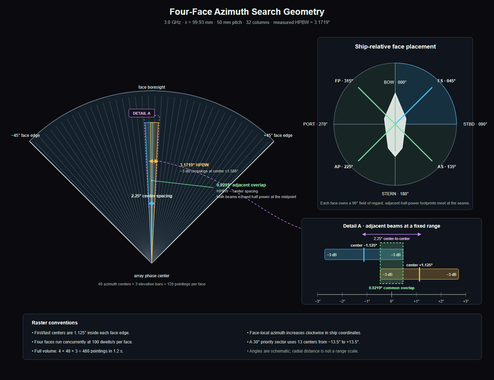
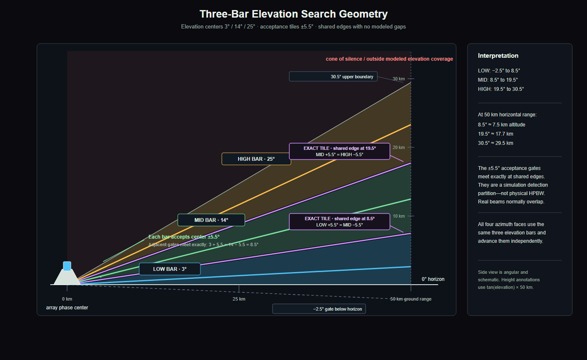

# Radar Display Operator Guide

This guide explains what the simulator shows, how the panels relate, and how
to answer common questions during a demonstration. It describes this
simulator's behavior, not a certified operational SPY-6 interface or tactical
employment doctrine.

## The 60-second briefing

The radar repeatedly points an electronically steered beam in azimuth and
elevation. For each beam position it receives a range trace, finds peaks above
a detection threshold, and associates repeated detections into tracks.

The displays show different stages of that process:

1. **A-scope:** receiver amplitude versus range for the beam pointing now.
2. **Detection:** a threshold-crossing return from one beam dwell.
3. **B-scope:** recent detections arranged by relative azimuth and range.
4. **PPI:** detections and tracks arranged geographically around the ship.
5. **Track:** multiple detections correlated over time into an estimated
   position and velocity.

A detection is evidence from one observation. A track is the radar's
time-filtered estimate that a contact exists and is moving in a particular
way. A colored dot is therefore not the same thing as a tracked target.

## Focus and presenter mode

Every panel has a small expand icon at the right side of its title bar.
Selecting it brings that panel to the full application client area for
detailed inspection. Focused panels automatically use a crisp 17-point font,
larger control spacing, and enlarged primary scope symbols and strokes so
they remain legible in screen-shared demonstrations.

Select the contract icon, double-click the panel title bar, or press `Esc` to
restore the complete dashboard. Only one panel can be focused at a time.
The covered dashboard panels continue processing live data while a panel is
focused, so their detections, phosphor, tracks, and timelines are current
when the dashboard returns.

## Coordinate frames: the most important distinction

| Display or field | Azimuth reference | Meaning of 0 degrees |
|---|---|---|
| PPI spokes, PPI cursor `BRG` | True/world bearing | True north |
| PPI sweep and detections | Converted to true/world bearing | True north |
| B-scope horizontal axis | Ship-relative azimuth | Straight over the bow |
| Target Tracks `AZ` | Ship-relative azimuth | Straight over the bow |
| A-scope `AZ` | Ship-relative beam azimuth | Straight over the bow |
| Beam Schedule azimuth | Ship-relative beam azimuth | Straight over the bow |
| Sector center and limits | Ship-relative azimuth | Straight over the bow |

Angles increase clockwise. The relationship is:

`true bearing = ship-relative azimuth + ship heading`, wrapped to 0-360
degrees.

For example, with FS selected, Sector Scan commands a 30-degree sector
centered at the face's 45-degree boresight. Its displayed limits are 30-60
degrees relative to the bow. With the simulator's nominal 45-degree heading,
that appears at 75-105 degrees true on the PPI. The displays agree; they use
different reference frames.

## PPI - Plan Position Indicator

The PPI answers: **Where are detections and tracks around the ship?**

- It is a north-up, 360-degree geographic view.
- The center crosshair is own ship.
- The short white line from the center is the ship's true heading.
- Range rings are labeled in kilometers.
- Spokes and labels are true bearings, clockwise from north.
- Four sweep arms show the independently scheduled faces. The selected face
  is brightest; an all-offline face is red and dim. Fading arcs are visual
  persistence, not additional beams.
- Thin radial boundaries divide the four 90-degree face fields of regard.
- The top readout shows true heading (`HDG`), ship speed in knots (`SPD`), and
  the selected display range (`RNG`).
- The mouse wheel changes the displayed range smoothly from 10 to 100 km. The
  initial range is 40 km.
- Moving the cursor inside the scope shows `CUR` range in kilometers and
  `BRG` as true bearing.

### PPI symbols and colors

**Glowing circular blips are detections.** They remain for about six seconds
and fade with age:

| Blip color | Simulated SNR |
|---|---|
| Green | 25 dB or greater: strong return |
| Yellow | 12 to less than 25 dB: medium return |
| Red | Less than 12 dB: weak return |

Red means **weak signal**, not hostile, dangerous, or enemy. The color does
not show target class or threat.

The simulator's internal detection threshold corresponds to roughly 14 dB
SNR, so its normal pipeline generally produces yellow or green blips. The red
band remains available for weaker `DetectionEvent` samples supplied by an
external publisher.

**Cyan diamonds are tracks.** A track also has:

- a `Txxxx` tracker-generated ID;
- range in whole kilometers and speed in m/s beside the symbol;
- a cyan trail of up to ten recent reported positions;
- a thin cyan line extending from the diamond in the estimated direction of
  travel. Its endpoint shows where the contact would be after 60 seconds if
  it maintained the same speed and course.

The track ID is assigned by the radar tracker. It is not the target
generator's truth ID and is not an IFF identity.

The thin line is a **velocity vector**, not the radar beam or a line from the
ship to the target. Its direction represents estimated travel direction, and
its length represents 60 seconds of estimated travel at the current PPI
scale. A new track may not yet have a usable velocity estimate, so its vector
can be zero-length, very short, or temporarily unstable. The fading,
multi-segment cyan line behind a moving track is different: that is the
contact's recent position history or track trail.

### Why a PPI item can behave unexpectedly

- A detection blip fades because it is a single observation with six-second
  display persistence.
- A track can remain after its latest blip fades because the tracker coasts an
  established estimate between beam revisits.
- A blip may never become a track if it is noise or cannot be associated with
  repeated observations.
- A track may disappear and later return with a new ID after the tracker
  drops it and reacquires the contact.
- A target outside the selected PPI range is not drawn even though the radar
  and the 100 km B-scope may still contain it.

## B-Scope - Range / Azimuth

The B-scope answers: **At what ship-relative bearing and range have recent
returns appeared?**

- Horizontal axis: 0-360 degrees ship-relative azimuth.
- `000` is over the bow; `090` is starboard; `180` is astern; `270` is port.
- Vertical axis: range, with near range at the bottom and 100 km at the top.
- The background intensity has a four-second half-life, producing
  phosphor-like persistence.
- Return intensity runs from black through blue, green, yellow, and red.
  Hotter color means stronger accumulated display intensity; it does not
  indicate target class or threat.
- Cyan squares and numeric labels are track overlays.
- Yellow dashed vertical lines are the selected face's commanded sector
  limits. They appear only when that face is in Sector Scan.

The B-scope keeps independent phosphor planes for FS, AS, AP, and FP. The
ARRAY FACE selector chooses which post-beamforming I/Q-derived plane is
visible. In the FS priority sector, the dashed limits are at 30 and 60
degrees. Other faces use the same 30-degree width centered on their own
boresight. The corresponding PPI sweep is rotated by ship heading.

### Beam-formation displays

When one or more RMAs are offline and **BEAM FORMATION** is not selected, the
B-scope retains its compact automatic outage indication:

| Overlay | Meaning |
|---|---|
| Faint amber/red curtain | Live response around the current scheduled beam; it moves left to right with the search scan |
| Dashed green line | Commanded beam center |
| Solid amber line | Effective boresight after modeled fallback calibration |
| Dotted red lines | Dominant left and right sidelobes |
| `BEAM DEGRADED` readout | Offline RMA count, gain loss, beamwidth, peak sidelobe level, and boresight error |

For a before/after comparison:

1. Select **BEAM FORMATION** in the **SCENARIOS** pane while all RMAs are
   online.
2. The centered 3D polar plot rotates around the beam axis every five seconds,
   showing the nominal beam and its sidelobes.
3. Click one or more blocks in **ARRAY FACE**.
4. The nominal plot first animates into the left half. The full-size degraded
   live plot then appears in the right half, separated by a center divider.
   Both continue rotating in phase so their shape differences remain directly
   comparable.
5. Click the same RMA again. The degraded plot retires while nominal moves
   back to center and replaces it.

The polar plot magnifies the physical -10 to +10 degree region around the
current beam. Radial distance is response in dB: the outer arc is 0 dB and
the center is -30 dB or lower. Blue is the fixed nominal reference. During
an outage, amber shows the degraded main lobe and red shows its sidelobes.
The degraded radial scale includes peak gain loss relative to the all-online
aperture.

Because one RMA is only 6.25% of the aperture, the degraded plot applies the
explicitly labeled `DISPLAY SPREAD` accent so a one-RMA shape change is
visible at console scale. The multiplier grows with the offline-RMA count.
It affects only the drawing's angular spread; the `WIDTH`, gain, pointing,
and sidelobe readouts remain the calculated physical values.

The abbreviations in the readout are:

- `LOSS`: peak array-gain loss relative to all 1,024 elements;
- `BW`: full 3 dB azimuth beamwidth;
- `PSL`: peak sidelobe level relative to the active main-lobe peak;
- `ERR`: effective boresight minus commanded azimuth.

The pattern comes from the physical positions of the offline RMA blocks, not
only their count. Two masks with the same number of failed RMAs can therefore
produce different patterns. Pure amplitude loss does not inherently steer
the coherent peak; the small displayed `ERR` explicitly models residual phase
calibration in the fallback beamformer after an asymmetric outage.

While **BEAM FORMATION** is selected, the current scan azimuth remains in the
numeric status readout, but the B-scope draws no marching curtain or moving
beam-feature markers. The 3D plots rotate slowly around boresight while their
angular coordinates remain relative to the scheduled beam.

Strong targets entering a dominant degraded sidelobe can produce an
occasional displaced detection or “ghost.” The model deliberately limits
this behavior to the two dominant sidelobes so the demonstration remains
bounded and explainable. Returning every RMA on the selected face online
removes the automatic curtain and restores its live pattern to nominal.
**BEAM FORMATION** remains selected until the operator toggles it off.

## A-Scope - Amplitude / Range

The A-scope answers: **What did the receiver see along the beam currently
being examined?**

- Horizontal axis: range from 0 to 100 km, labeled every 10 km.
- Vertical axis: linear receiver magnitude. It is intentionally not labeled
  in dB.
- The window title shows the selected face code plus its current
  ship-relative beam azimuth (`AZ`) and elevation (`EL`).
- The green line is the receiver magnitude by range bin, with brief
  phosphor-style peak persistence. It is the RMS magnitude after noncoherent
  integration of the ten pulses in the selected 10 ms dwell.
- A yellow triangle marks each local peak above the simulated CFAR detection
  threshold.
- The cyan `GATE` bracket surrounds the strongest above-threshold peak and
  reports its approximate range. It is a display marker, not an
  operator-adjustable tracking gate.

The baseline wiggle is receiver noise. Noise remains visible even when no
target is in the beam or all RMAs are offline. A strong peak appears only when
a sufficiently detectable target is within the current azimuth and elevation
beam.

`CFAR` means constant false-alarm rate: a thresholding method intended to
separate likely returns from noise while controlling false detections. This
simulator uses a simplified fixed threshold in its CFAR-like processing.

## Target Tracks

The list is sorted nearest contact first.

Units appear on a second line in each numeric column heading so the row values
stay compact and aligned.

| Display heading | Meaning |
|---|---|
| `ID` | Radar track number, shown as `Txxxx` |
| `CLASS` | Simplified kinematic classification |
| `RNG [km]` | Horizontal ship-relative range estimate |
| `AZ [deg]` | Ship-relative azimuth |
| `SPD [m/s]` | Estimated horizontal speed |
| `ALT [m]` | Estimated height above the ship-relative plane |
| `QUAL [0-100]` | Tracker maturity/quality score |

`QUAL` is not a percentage probability and not IFF confidence. New tracks
begin at a lower score, gain two points per associated detection, and are
capped at 100.

The classifications are simplified:

| Label | Nominal target type | Simulator meaning |
|---|---|---|
| `AIR` | Fighter, bomber, or decoy | Air-breathing-like motion, generally 100-300 m/s |
| `BAL` | Missile | Ballistic-like motion, greater than 300 m/s |
| `SURF` | Ship | Slow, low-elevation contact, generally less than 30 m/s |
| `UNK` | Drone or unmatched contact | Kinematics do not yet fit one of the modeled categories |
| `CLTR` | None | Clutter label supported by the display; the current tracker does not assign it |

Classification is based on estimated motion and geometry. It is not target
truth, platform identification, IFF, intent, or threat assessment. Altitude
is derived from one of three coarse elevation bars, so it should not be
presented as precision altitude.

## Beam Schedule

The timeline answers: **Where has the electronically steered beam been
commanded recently?**

- Horizontal axis: time in seconds relative to the oldest visible command.
- Green trace and left axis: selected-face ship-relative azimuth.
- Amber trace and right axis: elevation.
- Search Mode produces a repeating 90-degree face-local sawtooth.
- Sector Scan produces a 30-degree back-and-forth trace around that face's
  boresight.
- Elevation cycles through 3, 14, and 25 degrees. It advances after a full
  face sweep or at each sector reversal.
- **PAUSE** freezes the current plotted history for inspection and changes to
  **RESUME**. The amber `FROZEN` readout shows the captured sample count.
  This is a display-only control: beam scheduling and DDS publication keep
  running. **RESUME** returns immediately to the latest live history.

Each of the four face instances advances at 100 beam dwells per second. A
face has 40 half-step-inset centers at 2.25-degree spacing and three
elevation bars, or 120 pointings. All four schedules run concurrently:
400 `BeamCommand` samples per second, 480 face-keyed pointings per
1.2-second full volume. The representative S-band model uses a 3.0 GHz
carrier (9.993 cm wavelength) and fixed 50 mm element pitch. The physical
32-column aperture consequently has a measured 3.1719-degree azimuth 3 dB
beamwidth. Adjacent centers are only 2.25 degrees apart, so their half-power
footprints overlap by about 0.92 degree instead of leaving gaps. The panel
filters its 2.4-second history to the selected face.



[Open the full-size interactive azimuth diagram](beam_spacing_geometry.html)
and click a section to isolate it.

The `-3 dB` marks are the two half-power boundaries of each physical azimuth
beam: power there is one-half of that beam's peak (voltage amplitude is about
0.707 of peak). They are not gaps or separate beams. Because adjacent centers
are closer than one full HPBW, the neighboring half-power footprints overlap.
At the exact midpoint between centers, both beams are still inside their
half-power contours, providing scan coverage margin.



[Open the full-size interactive elevation diagram](elevation_geometry.html)
and click a bar or interpretation section to isolate it.

Elevation is deliberately different. The simulator commands only three bar
centers and applies a hard ±5.5-degree truth-elevation acceptance test:

| Commanded bar center | Accepted target elevation |
|---:|---:|
| 3° | -2.5° through 8.5° |
| 14° | 8.5° through 19.5° |
| 25° | 19.5° through 30.5° |

For each dwell, the receiver calculates a target's true geometric elevation
from its horizontal range and height. A target outside the commanded bar's
interval contributes no return. A target inside it is accepted without an
additional elevation-pattern attenuation; its return amplitude still includes
the modeled azimuth array response and other receiver effects. The resulting
`DetectionEvent` carries the commanded center—3°, 14°, or 25°—rather than a
continuously estimated target angle. For example, a target at 12° elevation is
accepted by the 14° bar and reported with a 14° elevation label.

The intervals tile the modeled coverage without gaps and, except at their
shared edges, without overlap. The implementation's inclusive comparison makes
a target exactly at 8.5° or 19.5° eligible for both adjoining bars when those
bars are visited at different times. This measure-zero boundary case does not
produce two returns in one dwell, but it can produce detections carrying
different bar labels on successive elevation sweeps.

These are elevation acceptance bins, not the `AIR`/`BAL`/`SURF` target
classifier and not a physical elevation-array factor or HPBW. A physical radar
would ordinarily have smooth elevation gain patterns, overlapping neighboring
beams, and reduced response away from each beam center. It might use monopulse
channels or comparisons between overlapping beams to estimate a continuous
arrival angle. This simulator does not model those mechanisms, so the tracker
treats each bar label as an 11-degree interval rather than as a precise angle.
When a track moves from one bar to another, the tracker projects its predicted
elevation to the shared boundary and suppresses the velocity correction caused
solely by the 11-degree label change. That prevents a bar transition from
appearing as an instantaneous vertical jump.

The receiver uses a 1 MHz pulse-compressed waveform at 1 kHz PRF. This gives
149.9 m range resolution, 149.9 km unambiguous range, and 668 complex cells
across the 100 km instrumented range. A 20 microsecond pulse creates an
approximately 3.0 km transmit/receive blind range. These are representative,
unclassified S-band search values, not claimed operational SPY-6 parameters.

The [interactive signal-processing pipeline](signal_processing_pipeline.html)
([static SVG](signal_processing_pipeline.svg))
compares the corresponding physical element-domain workload with the
implemented post-beamforming DDS stream, dwell integration, plot extraction,
and track output.

The underlying beam-command priority is 3 in Search Mode and 2 in Sector
Scan, but this panel plots only azimuth and elevation.

## System Health

The panel summarizes the selected face's array-calibration instance. Each of
the four face instances publishes once per second and promptly on changes.

| Readout | Meaning |
|---|---|
| `NOMINAL` | No injected degradation and no offline RMA |
| `DEGRADED` | Some elements or RMAs are unavailable, at most 200 failed elements |
| `CRITICAL` | More than 200 elements are counted failed |
| `OFFLINE` | All 16 RMAs are offline |
| `DDS BUS` | Green presentation indicator in the current UI |
| `TEMP` | Simulated array temperature in degrees Celsius |
| `FAILED` | Failed or offline elements out of 1,024 |
| `DRIFT` | Mean absolute per-element gain drift in dB |
| `RMA OFF` | Offline Radar Modular Assemblies out of 16 |
| Progress bar | Failed-element fraction |

The current `DDS BUS` lamp is always drawn green; it is not a live connection
or QoS alarm. Use Connext Studio or application diagnostics for actual DDS
health.

The `DRIFT` average is shown as a positive magnitude because the UI averages
the absolute value of every element's drift. Offline elements at -60 dB make
that average rise sharply.

## Array Face

The selector at the top chooses one of four independent physical faces: FS,
AS, AP, or FP. The selected face is a logical 32-by-32 map of 1,024
transmit/receive elements. The heavier boundaries divide it into 16 Radar
Modular Assemblies (RMAs). Each RMA is an 8-by-8 block containing 64
elements. The A-scope, B-scope, beam timeline, health panel, and
face-addressed scenario controls follow the same selection.

RMA numbering is row-major:

```text
 0   1   2   3
 4   5   6   7
 8   9  10  11
12  13  14  15
```

Each cell shows gain drift relative to the nominal 0 dB calibration:

| Cell color | Drift and meaning |
|---|---|
| Green | -0.45 dB or greater: nominal in this model |
| Yellow-orange | Less than -0.45 dB down to -1 dB: moderate negative drift |
| Red | Less than -1 dB down to -20 dB: hard failure/degraded element |
| Dark red/black | Less than -20 dB: RMA offline; normally -60 dB |

The calibration data updates once per second. Normal drift is random around
0 dB, so an individual element can momentarily cross below -0.45 dB, turn
yellow-orange, and return to green on the next sample. That flash is a
calibration warning, not a transmitted pulse or target detection.

This simplified color rule warns only on negative gain drift. Positive drift
is drawn green even if its magnitude is large.

Negative dB means less gain than the nominal reference:

- 0 dB is nominal gain;
- a small negative value is a small loss;
- approximately -6 dB is the injected hard-failure state;
- -60 dB is effectively dark/offline.

Clicking an RMA toggles that block only on the selected face. Its outline
reacts immediately; the 64 heatmap cells normally follow within about 20 ms,
with a 1 Hz heartbeat. The whole-face button reads `ALL OFFLINE` until every
RMA on that face is dark, then changes to `ALL ONLINE`. Neither action
changes another face.

Taking RMAs offline reduces simulated target return gain monotonically. It
also changes the calculated azimuth width, pointing error, and sidelobes
according to the location of each failed block. Width and pointing therefore
need not change monotonically for every mask: symmetric failures can cancel
pointing error, while edge or fragmented failures can broaden the beam more
than other masks with the same count. Receiver noise is retained, and the
finite -40 dB telemetry floor keeps the plot readable. With all RMAs offline,
physical receive gain is exactly zero and no new detections are published.
Existing confirmed tracks can remain visible for the 12-second coast interval;
they are not new measurements.

## Ship Position

| Field | Meaning |
|---|---|
| `LAT` | WGS-84 latitude in degrees |
| `LON` | WGS-84 longitude in degrees |
| `HDG` | True direction the bow points |
| `COG` | Course over ground: actual direction of travel |
| `SOG` | Speed over ground in knots |
| `PIT` | Pitch: fore-and-aft attitude angle in degrees |
| `ROL` | Roll: side-to-side attitude angle in degrees |

Heading and course can differ on a real vessel because of current, wind, or
sideslip. This simulator sets both to 45 degrees. It models approximately
20 knots of ship speed plus gentle sinusoidal pitch and roll.

## Scenario controls

A green-highlighted scenario button indicates a persistent state. Momentary
commands do not remain highlighted.

| Control | What it does | What to expect |
|---|---|---|
| `SEARCH MODE` | Selects full-volume search on the selected face | That face resumes its 90-degree field of regard; beam priority 3 |
| `SECTOR SCAN` | Selects a 30-degree sector centered on the selected face boresight | Thirteen centers span boresight ±13.5 degrees; priority 2 |
| `DEGRADE ARRAY` | Injects a stable sparse failure pattern on the selected face | About 12% red elements, degraded health, RMA mask unchanged |
| `RESTORE ARRAY` | Clears selected-face sparse failures | Does not return manually disabled RMAs online |
| `SELF TEST` | Sends the self-test command | No component currently consumes it and no result is displayed |
| `RESET TRACKS` | Disposes current tracks and returns all faces to Search Mode | Detections continue; tracks automatically reacquire over later revisits |
| Click an RMA | Toggles that selected-face 64-element block offline/online | Outline changes immediately; face/health normally follow within about 20 ms |
| `ALL OFFLINE / ALL ONLINE` | Toggles every selected-face RMA | Does not clear the separate `DEGRADE ARRAY` state |

`DEGRADE ARRAY` changes calibration and health data only. In the current
model, its approximately 12% isolated red elements do not reduce detection
gain. Manual whole-RMA removal is the array action that affects the simulated
signal path.

## Common questions and short answers

**Why do PPI and B-scope angles differ?**  
The PPI is north-up and uses true bearing. The B-scope is relative to the
ship's bow. Add ship heading to relative azimuth to compare them.

**Why is a PPI blip red? Is it hostile?**  
No. Red is a weak-SNR detection. Classification and hostility are different
questions; hostility is not modeled.

**Why is there a dot but no track?**  
One integrated dwell can create a detection plot. The tracker requires three
spatially consistent visits from independent face scans within its five-scan
initiation window before publishing a track. Overlapping beams from the same
visit do not count more than once.

**Why is there a track but no fresh dot?**  
Tracks coast between beam revisits, while individual detections fade.

**What is the thin blue/cyan line extending from a PPI track?**

It is the track's velocity vector: a 60-second constant-speed,
constant-course projection. A new track may not show a noticeable line until
the tracker develops a velocity estimate. The fading line behind the contact
is its recent track history, not the projection.

**Why do tracks disappear in Sector Scan?**  
Only contacts in the selected relative sector receive regular illumination.
Tracks outside it eventually age out if they receive no new detections.

**Why does a track return with another ID?**  
After a track is dropped or reset, reacquisition creates a new tracker
instance and may assign a different ID.

**Why are A-scope peaks constantly changing?**  
It shows only the current beam dwell, and the beam is rapidly changing
azimuth and cycling elevation bars.

**Why is there A-scope activity with no target or with the array offline?**  
The receiver model always contains noise. Only above-threshold local peaks
become detections.

**Why does the B-scope retain old-looking spots?**  
It deliberately simulates phosphor persistence with a four-second intensity
half-life.

**What are the green, amber, and red lines moving across the B-scope?**

They are the RMA-outage beam overlay. Green is the commanded beam, amber is
the effective main lobe and its 3 dB width, and red marks the strongest
sidelobes. The overlay appears only while at least one RMA is offline and
**BEAM FORMATION** is not selected. Select **BEAM FORMATION** to replace this
compact moving indication with the animated side-by-side nominal-versus-live
polar comparison.

**Why can an RMA outage create a displaced detection?**

A strong target can cross a degraded sidelobe even though it is outside the
main beam. The receiver assigns that return to the commanded dwell azimuth,
so it can appear at the wrong bearing as a short-lived sidelobe ghost.

**Why did one array element briefly turn yellow-orange?**  
The one-second calibration sample placed its simulated gain drift below
-0.45 dB. Normal random drift can cross that boundary for one sample.

**Why did an offline RMA outline change before its cells went dark?**  
The command mask gives immediate outline feedback. The DDS-fed element
calibration values normally follow within about 20 ms; a 1 Hz heartbeat keeps
the state fresh even when it does not change.

**Why did RESTORE ARRAY leave a dark block?**  
Restore clears the selected face's sparse degradation scenario. If every RMA
is offline, use the now-visible `ALL ONLINE` action; otherwise toggle the
manually disabled blocks individually.

**Why did tracks reappear after RESET TRACKS?**  
Reset removes existing tracker instances; it does not stop beam scanning or
detection processing.

**Why did SELF TEST appear to do nothing?**  
It currently demonstrates the command path only. There is no self-test
result state or display in this version.

## Units and abbreviations

| Term | Meaning |
|---|---|
| AESA | Active Electronically Scanned Array |
| RMA | Radar Modular Assembly; 64 elements in this simulation |
| T/R element | Transmit/receive element |
| PPI | Plan Position Indicator |
| SNR | Signal-to-noise ratio |
| CFAR | Constant False-Alarm Rate processing |
| PSL | Peak sidelobe level relative to the main-lobe peak |
| dB | Logarithmic ratio; array drift is relative to nominal gain |
| dBsm | Radar cross section relative to one square meter; influences simulated detectability but is not displayed |
| HDG | Heading |
| COG | Course over ground |
| SOG | Speed over ground |
| PIT / ROL | Pitch / roll |
| AZ / EL | Azimuth / elevation |
| ENU | East, north, up Cartesian coordinates |
| IFF | Identification Friend or Foe; not modeled by this display |

## Safe summary for a live demonstration

“The A-scope shows the receiver data for the current beam, the B-scope
accumulates detections by relative bearing and range, and the north-up PPI
places detections and tracker estimates around the moving ship. The lower
panels explain the track solution, scan pattern, ship state, and health of the
1,024-element array. Colors are display-specific: PPI blip color is signal
strength, B-scope color is accumulated intensity, and Array Face color is
element gain health. None of those colors indicates hostility.”
